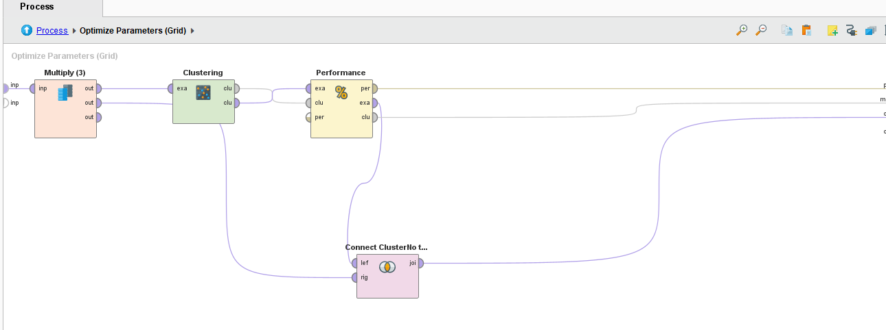
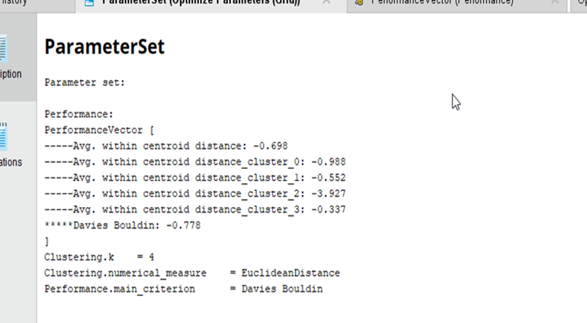
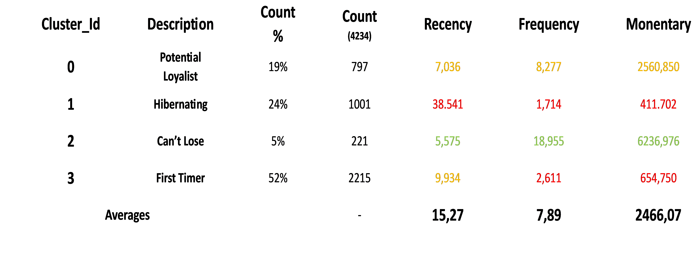
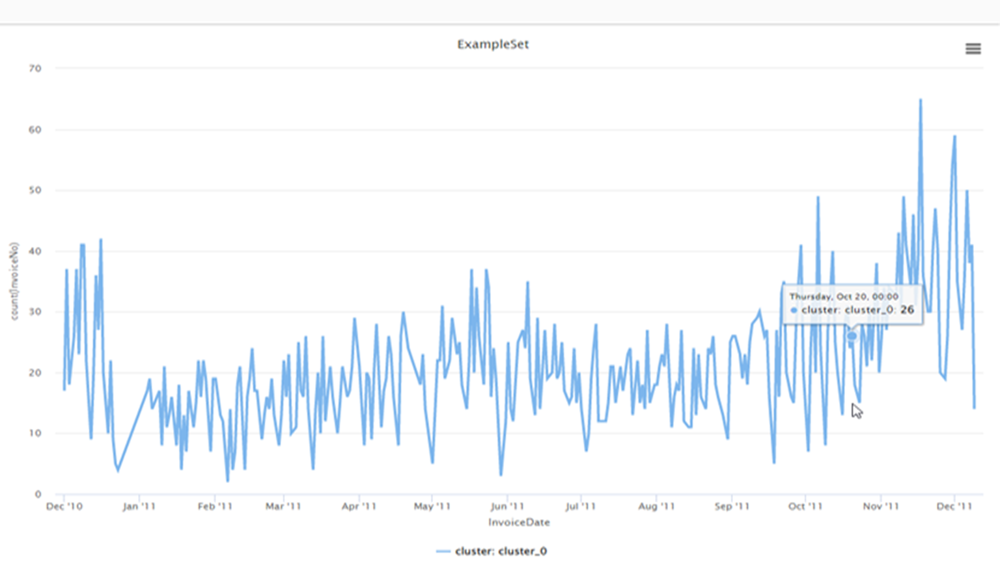
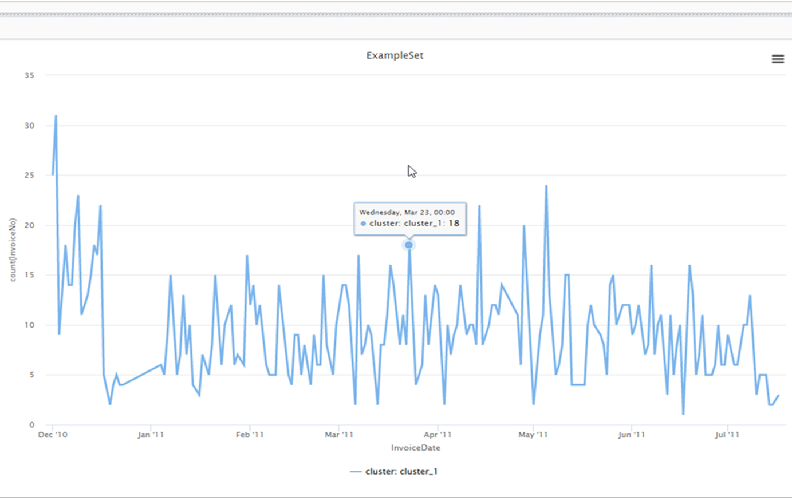
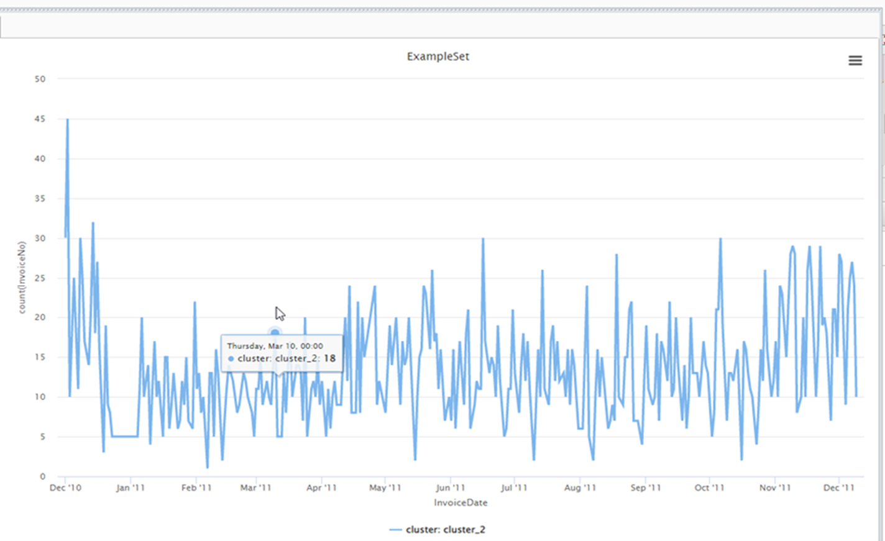
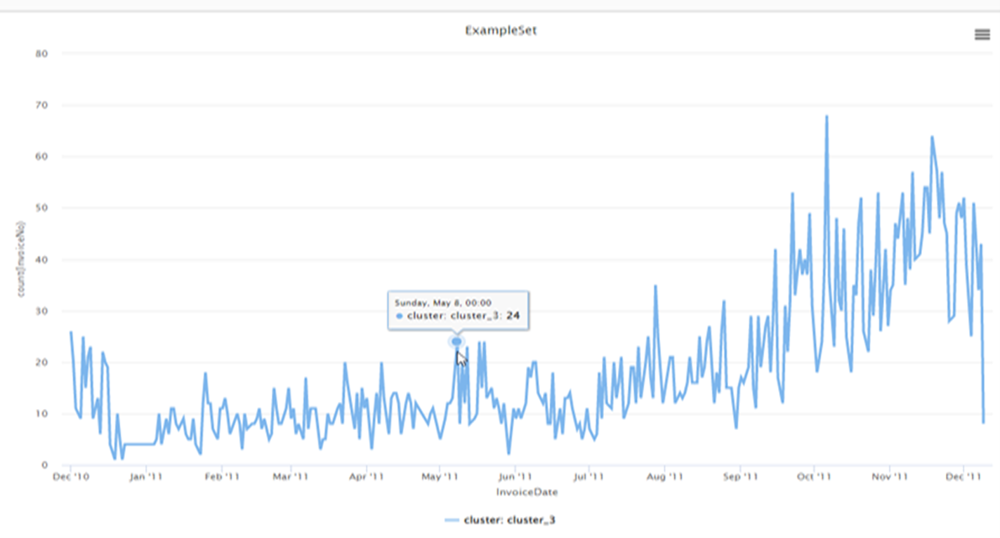

## Unlock Customer Insights: RFM Segmentation & Clustering with RapidMiner

This project showcases my expertise in implementing RFM methodology and clustering using RapidMiner for dynamic customer segmentation. It highlights my proficiency in utilizing these techniques to unlock valuable customer insights, aiding businesses in targeted marketing and strategy formulation.

## Objective:

It's late 2011, and company XYZ hires us as analysts to analyze sales data from its online store. Specifically, the company is interested in segmenting its customers based on their purchasing behaviors to create distinct campaigns for each customer type. This approach aims to achieve more targeted advertising at a lower cost. 

## Key Highlights:

**RFM Methodology:** Leverage the Recency, Frequency, and Monetary framework to decode customer behavior patterns.

**RapidMiner Implementation:** Utilizing RapidMiner for seamless data processing and analysis.

**Clustering Techniques:** Use K-mean algorithm to group customers into meaningful segments for tailored strategies.

**Insightful Visualizations:** Gain actionable insights with visually compelling representations of customer segments.


## Tools Used:

   **Rapidminer Studio** for data transformation, RFM analysis using k-means algorithm and some basic visualizations

## What is RFM Analysis?

The initials RFM correspond to the values of Recency, Frequency, Monetary. RFM analysis is a way to utilize the data we have already gathered from various customer transactions to predict how a future consumer is likely to behave. An RFM model is based on **three factors**:

*Recency --> How recently a consumer made a purchase*

*Frequency --> How often the consumer makes purchases*

*Monetary --> What is the total amount the consumer spends*

## Project Overview:
## 1. **Data Acquisition:**

  The sales data can be found at the following link: https://www.kaggle.com/datasets/rupakroy/online-retail.

  There are 541,909 records (examples) of transactions.
  
  It covers a time period from December 1st, 2010, to December 9th, 2011, which is a span of 12 months or approximately 55 weeks.

## 2. **Data Engineering**

  Loading the data, proper definition of variables from the CSV file, and searching for missing values in attributes. Verifying whether missing values impact the analysis results. Also using the available data to create three new attributes (Recency, Frequency, Monetary) and constructing a new table (RFM table).
   
  *Create RFM Attributes*

  For Recency select the attributes Customer_id and InvoiceDate using the Select Attributes operator. I create a new attribute indicating the number of weeks that have passed since each purchase (assuming I'm on 31/12/2011) using the following formula:

```
round(date_diff(InvoiceDate,date_parse_custom("30.12.2011","dd.MM.yyyy"))/604800000,0)
```
  Finally, I aggregate the minimum recency with group by customer_id to determine how many weeks ago the customer made their last purchase (most recent purchase).

  For Frequency, select the attributes Customer_id and InvoiceNumber using the Select Attributes operator. I keep only the unique Invoice Numbers for each customer using the remove duplicates operator. Finally, I aggregate the count of Invoice Numbers with group by customer_id to find how many unique orders each customer placed within the examined timeframe.

  For Monetary,  select the attributes Customer_id, Quantity, and Unit Price using the Select Attributes operator. I create a new attribute for the total cost of the purchase using the following formula:

```
round(Quantity*UnitPrice,2)
```

  Finally, perform an aggregation using the sum function for 'monetary', grouped by 'customer_id', to determine the total amount of purchases made by each customer within the examined timeframe.

## 3. **Data Transformation**

Visualization of the new table and checking for outliers in each attribute. Applying filtering if extreme values are detected. Normalizing the data if they are on different scales.

*Outliers*

Checking to detect any outliers. From the visualization, as seen in the image below, I observe the following:

Recency doesn't display any outliers, and the data exhibits a certain distribution.
 


The Frequency column shows a potential outlier at 89 (as also depicted in the related box plot below). Additionally, I notice that the number of occurrences is below 43, while I have three values (89, 86, 52) significantly deviating from the 43, potentially impacting the clustering algorithm as outliers. Logically, the business is likely aware of its top customers, those who shop 89, 86, 52, 43, 40 times during the year (almost weekly), and their specific characteristics. Therefore, the analysis to be conducted will be useful for mining insights from customers with less obvious traits. Hence, we'll filter the frequency for values <40.


The Monetary column displays values <0, so I set a filter for values >0, as these are the valid monetary values. Additionally, I notice that the volume of values is <25,000, so I place a filter for outliers <25,000, given that, as shown in the histogram, I have some extreme values.


## 4. **Clustering with k-means**

  Applying clustering using the k-means algorithm and checking the clusters upon completion. Also assigning each customer_id to the corresponding cluster (Customer segmentation). I begin this step, with normalizing my data (Normalization) using Z-Transformation since, as easily distinguished, the data are in different measurement units. I also use the SetRole operator to designate the customer ID as a role.

*Utilizing the optimization parameter operator to select the optimal number of k.*

Based on literature, in order to choose the optimal k number, I employ the Optimization Parameter operator to find the k value resulting in the smallest Davies-Bouldin Index (DBI). The minimum k value (for RFM analysis) is k=4 (meaning 4 customer segments), so I proceed to modify the operator accordingly. Also the clustering process modules an their connection on RapidMiner are displayed below:



Moreover from the image below, I infer that for the dataset under consideration, **the optimal number of segments is k=4 with a DBI of -0.778. Therefore, I understand that I'll have 4 customer personas (segments) in my analysis**



## 5. **Segmentation Analysis**

  With the optimal segmentation number identified as k=4, I delve into the segmentation analysis. Each of the four customer personas represents a distinct group with unique behavioral patterns and preferences. This segmentation allows for tailored marketing strategies, personalized communication, and product offerings, aligning precisely with the distinct needs and tendencies of each customer segment. By understanding the nuances within these segments, the business can optimize its resources, enhance customer satisfaction, and foster long-term relationships, thereby maximizing its overall efficiency and profitability. Below there are the 4 different personas, their RFM values, followed by proposals for each one of them.


   
The segmented analysis identifies diverse customer groups, ranging from potential loyalists and hibernating customers to high-value advocates and first-time buyers, each requiring targeted strategies for engagement and retention.

**👍Cluster 0: Potential Loyalist**

*Overview:* Moderate Recency (average of 7 weeks), high Frequency (average of 8.2), and high Monetary (2560 euros). Medium-sized customer base (797).

*Recommendations:* Target for engagement; encourage product reviews with discounts and introduce a loyalty program for regular customers.

**👍Cluster 1: Hibernating**

*Overview:* High Recency (average of 38 weeks), low Frequency (average of 1.7), and low Monetary (411 euros). Medium-sized customer base (1001).

*Recommendations:* Launch low-cost campaigns to re-engage; consider targeted advertising.

**👍Cluster 2: Can’t Lose**

*Overview:* Very high Recency (average of 5 weeks), very high Frequency (average of 18.9), and very high Monetary (6236 euros). Small customer base (221).

*Recommendations:* Leverage as brand advocates; encourage reviews, referral programs, and exclusive offers for high-value products.

**👍Cluster 3: First Timer**

*Overview:* Moderate Recency (average of 10 weeks), low Frequency (average of 2.6), and low Monetary (654 euros). Large customer base (2215).

*Recommendations:* Identify their preferred products and peak buying periods for targeted marketing; send limited-time offers to boost engagement.

## 6. **Seasonality**

The analysis combines cluster segmentation with seasonality to understand distinct customer behaviors over time. Each cluster exhibits unique seasonal purchase patterns, providing actionable insights to tailor promotional strategies and engagement efforts effectively.

**👍 Cluster 0 (Potential Loyalist):**

Shows consistent buying with peaks in late September through October and November. Inactive late December to early January. 

*Recommended actions:*

📌 Activate engagement during inactive periods.

📌Offer promotions during peaks to boost consumption.



**👍Cluster 1 (Hibernating):**

Notable sales during Christmas-New Year and some peaks in April-May. 

*Recommended actions:*

📌Target promotions during these periods.



**👍Cluster 2 (Can’t Lose):**

Similar to Hibernating, with peak buying late December. Inactive late December to early January. 

*Recommended actions:*

📌Activate engagement during inactive periods.

📌Offer promotions during peak times.



**👍Cluster 3 (First Timer):**

Higher sales mid-August to early December. No significant peaks.

*Recommended actions:*

📌Direct promotions during these specific periods for engagement.



## References

*Inspired by [Value Segmentation & RFM Analysis]([https://mohamedirfansh.github.io/Airbnb-Data-Science-Project/](https://rapidminer.com/wp-content/uploads/2022/04/project14.pdf)*

*Hofmann, M., & Klinkenberg, R. (2016). RapidMiner. Chapman and Hall/CRC. ISBN 9781498759861.*

*Dwiza Riana (2018), Customer Segmentation based on RFM model and Clustering Techniques With K-Means Algorithm, 2018 Third International Conference on Informatics and Computing (ICIC)*
   
